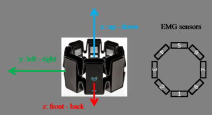
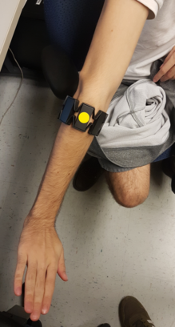
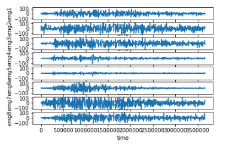
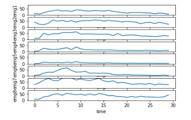
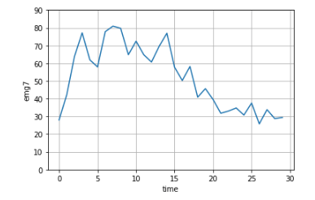

# SVM Model

If this project was to able to be fully intergrated inside of the prothesis using a 60 MHz microcontroller while managing 5 actuator and receving 1600 bytes a seconds from the myo, a complex algorithm wasn't possible. Thus the linear support vector machine was chosen, for even if it is restrictive in the type of data it can learn from, it's actual classifier is simple dot product operation.

## Requirements
    - Python3
    - Jupyter
   **Installing requirments**  
    - pip3 install -r requirements

## Generating experiment data
When it comes to performing the acquisitions, a protocol was established to ensure consistent results.

As mentioned earlier, the acquisition of EMG data was done with the Pewter tool, which in turn depends on the Myo connect software.

##### Placement of the arm band
Band details             |  Band position
:-------------------------:|:-------------------------:
  |  
	
The yellow sticker placed on the Myo (right picture) corresponds to the sensor no.8 (left picture). Also, the USB port on the band should be pointing towards the user's hand.

**Acquisition sequence**  
As seen on the "Signal anatomy" figure, the acquisition data is divided into two stages: a resting stage and active stage. This is because we followed a protocol when acquiring training data :

* Place hand in a relaxed position (no strain in the muscles) for about 1 second.
* Place hand in the wanted pose and hold the pose for about 2 seconds.

We chose this approach because it makes it easier to isolate the wanted data during preprocessing and because it ensures consistency throughout the data set.

## Exploring the dataset
We made a jupyter file to explore our dataset.
1. First select the pose dataset to explore
2. Select the index to observe  

###### data_observation_script.ipynb
Raw channel                |  RMS equivilent
:-------------------------:|:-------------------------:
 | 

NOTE: RMS representation is the calculation of the root mean square (RMS) of 50 data points on a channel, representing 250 ms of data as a ssingle value. Which outputs a vector of size 8.

By observing each pose, we'll discover that each of them has a different EMG channel that drives the movement. For exemple Wrist_flexion is driven by the muscle under channel 7. The other ones are: Fist & channel 4, Wrist_extension & channel 5, Finger_spread & channel 2.

## Feature Extraction

Now that we've identified some sort of partern in our dataset, we can start extracting features from each experiments. The first step is to split each experiments into matrix of 8x50 in order represent a state in a time interval of 250 ms. But there is a problem in the way we have been gathering data from our experiments. There is, in fact, three distinct states inside of a single experiment. Usually, we would start recording while our hand is in a resting postion then transition into the desired pose. This is represented into the following plot.

 

This means that we also need to label each intervals. We can do that by using the RMS representation of the signal we've identifiedduring the exploration process and setting the threshold at which we can say for certain that the movement has begun. This threshold will depend on many caractheristics, but when passing value of 20 we can say that the arm has stop resting and at 35 the movement we're doing has gegun. Sometimes, the experiment began during the desired pose and there isn't rest nor transition state, the rull still hold true. The only problem occures when the main signal goes back under that set threshold. We can label those as unknow state since we can know for certain what was going on at that precise period of time.

    - `notes_Hand_close.txt`
    - `notes_Hand_open.txt`
    - `notes_Wrist_flexion.txt`
    - `notes_Wrist_extension.txt`

These file contains the note of a script that has gone trough the entire dataset and wrote notes using this format:  
             [ file_num, rest_end_index, pose_begin ] [exception_interval]

Using those notes, we can now extract features from the dataset and label them using this script.

##### feature_extract_v1.py

We have now obtain labeled vector each represting a state. Our project's dataset offers 5 classes with a total if just under 12,000 labeled vectors ready for learning algorithm.

##### /full_data_set/pose_instant_data.json  
Rest :0             || size = 2139   
Hand close :1       || size = 1959    
Hand open :2        || size = 2200   
Wrist extension :3  || size = 2522   
Wrist flexion :4    || size = 2457   
None :5             || size = 268 

## SVM

Training the support vector machine algorithm is a simple task using python. Instead, here is the classification report and the confusion for a linear support vector classifier passed trough standard scaler. 
#TODO

    0    1     2     3     4
0   2062 15    29    31    2  
1   22   1928  2     6     1  
2   57   15    1966  161   1  
3   161  0     80    2281  0  
4   2    1     0     0     2454
 
              precision    recall  f1-score   support

           0       0.89      0.96      0.93      2139
           1       0.98      0.98      0.98      1959
           2       0.95      0.89      0.92      2200
           3       0.92      0.90      0.91      2522
           4       1.00      1.00      1.00      2457

